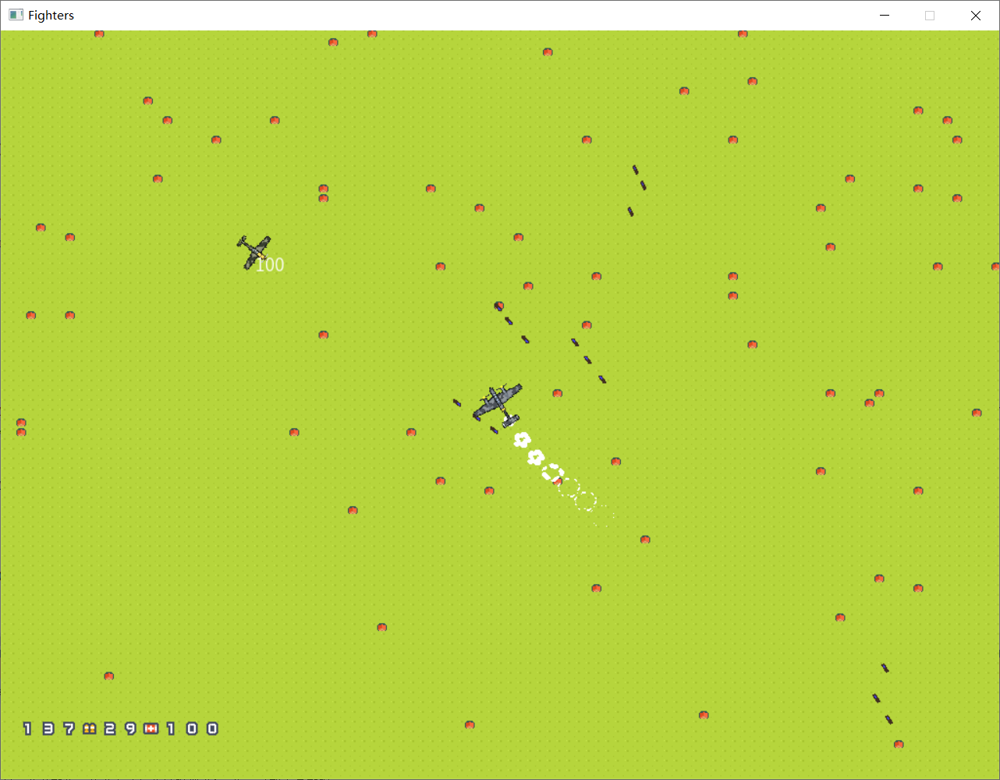

# Project: Box

ProjectBox is a simple fighter-shooting game.

# Assets used

The following assets are used in this project. All credits to their perfect work! ProjectBox does not hold any copyright to these assets and the resources directory is just included for easy to setup.

[思源黑体 CN | Adobe Fonts](https://fonts.adobe.com/fonts/source-han-sans-simplified-chinese)

[Bullet Hits Metal Ricochet Free Sound Effects](https://www.youtube.com/watch?v=1QUcxXGGRPA)

[Airplane Sound Effects](https://www.soundjay.com/airplane-sound-effect.html)

[Propeller Plane Sound Effects](https://www.soundjay.com/propeller-plane-sound-effect.html)

[Free FX - Pixel Art Effect - FX062](https://nyknck.itch.io/fx062)

[WW2 aircrafts pack by jh2assets](https://jimhatama.itch.io/ww2-aircrafts)

[Pixel Shmup by Kenney (Assets)](https://kenney-assets.itch.io/pixel-shmup)
